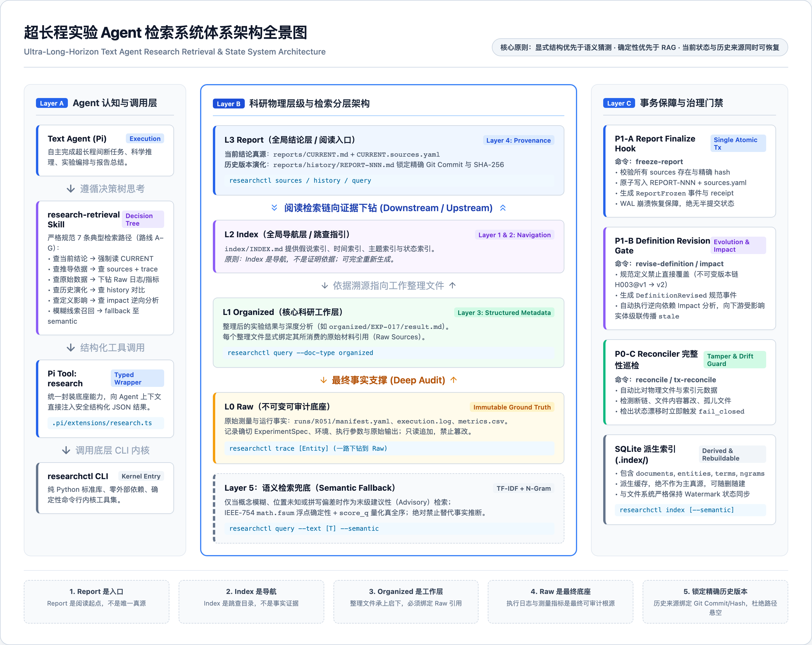

# ResearchCTL · 文字 Agent 检索与超长程实验状态系统

[](https://www.python.org/downloads/)
[](#技术架构与引擎实现)
[](#基准测试与自动化验证)
[](#许可证)

> **让 Agent 即使在超长程、多轮断续会话中遗忘历史，也能沿着确定、可审计、可证伪的因果链路重新找回真实依据。**

---

## 目录

- [1. 项目全景](#1-项目全景)
- [2. 为什么需要 ResearchCTL？](#2-为什么需要-researchctl)
  - [2.1 传统 RAG 在超长程科研中的失效](#21-传统-rag-在超长程科研中的失效)
  - [2.2 五大不可动摇的核心设计原则](#22-五大不可动摇的核心设计原则)
- [3. 四大科研物理层级与检索分层体系](#3-四大科研物理层级与检索分层体系)
  - [3.1 四大科研物理层级（L0 → L3）](#31-四大科研物理层级l0--l3)
  - [3.2 五层检索能力与优先级铁律](#32-五层检索能力与优先级铁律)
- [4. 系统软件架构与核心子系统](#4-系统软件架构与核心子系统)
- [5. 快速上手指南](#5-快速上手指南)
  - [5.1 环境要求与安装](#51-环境要求与安装)
  - [5.2 CLI 核心命令使用示例](#52-cli-核心命令使用示例)
  - [5.3 Pi Coding Agent 扩展与技能集成](#53-pi-coding-agent-扩展与技能集成)
- [6. 基准测试与自动化验证 (ResearchCTL-Bench)](#6-基准测试与自动化验证-researchctl-bench)
  - [6.1 八大评测轨道 (Tracks 1–8)](#61-八大评测轨道-tracks-18)
  - [6.2 运行自动化测试与负向控制门禁](#62-运行自动化测试与负向控制门禁)
- [7. 代码仓库结构](#7-代码仓库结构)
- [8. 研发里程碑与合约体系](#8-研发里程碑与合约体系)
- [9. 许可证](#9-许可证)

---

## 1. 项目全景

**ResearchCTL** 是一套专为**现实时间跨度数天至数周、涉及数百次断续会话、数十次参数与假说演化**的超长程科研实验（Ultra-Long-Horizon Experiments）打造的 Text Agent 检索与科研状态管理系统。

系统配合配套的因果评测基准 **ResearchCTL-Bench**，彻底解决了大语言模型 Agent 在超长程科研场景中由于上下文丢失、向量相似度漂移、假说演化脱节而导致的“幻觉”、“断代”与“证据链丢失”难题。



系统实现了三维解耦架构：
1. **Agent 认知与交互层**：通过严密的技能决策树指导 Agent 的检索行为，依托原生 Typed Tool 返回强类型 JSON；
2. **物理层级与双向链条**：自顶向下的“阅读理解链”（CURRENT → Index → Organized → Raw）与自底向上的“穿透审计链”（Conclusion → Organized@Commit → Run → Raw）；
3. **事务治理与一致性门禁**：基于不可变事件日志（WAL）、两阶段冻结提交与逆向依赖影响分析，确保信息链路坚不可摧。

---

## 2. 为什么需要 ResearchCTL？

### 2.1 传统 RAG 在超长程科研中的失效

在传统长程任务中，Agent 通常依赖“上下文滑动窗口”或“向量切片检索（Embedding-based RAG）”。但在真实的严肃科研实验中，传统方案存在三大根本失效点：

1. **版本漂移与脑补（Version Drift）**：当实验规格从 `EXP-017@v1` 演进为 `EXP-017@v2` 时，语义向量检索只能计算词义相似，无法识别严格的版本边界与前驱依赖，极易混合新旧数据并得出错误推论；
2. **因果溯源链断裂（Provenance Broken）**：向量检索无法回答“当前报告中‘准确率提升 4.2%’这个结论究竟基于哪份整理文件？对应的原始测试日志和指标文件在哪里？”；
3. **第二真源陷阱（Second Source of Truth）**：传统系统将向量数据库或外置索引作为真相本身。一旦索引构建落后于文件修改，或存在脏读，Agent 就会在错误的衍生数据中深陷幻觉。

### 2.2 五大不可动摇的核心设计原则

依据《超长程实验 Agent 检索系统设计方案.md》§25，系统确立了五条底线原则：

1. **Report 是入口，不是唯一真源**：报告（`CURRENT.md`）是叙述入口，最终可审计底座永远是 Raw 原始数据。
2. **Index 是导航，不是证明依据**：`INDEX.md` 仅用于跳查目录，可随删随建，绝不能作为证明事实的依据。
3. **Organized 是主要研究工作层**：实验整理文件承上启下，必须显式声明所消费的原始材料与实验规格。
4. **Raw 是最终可审计底座**：不可变的测量指标与执行日志是唯一物理事实根源。
5. **历史来源必须锁定具体版本**：历史报告引用的整理文件必须绑定具体 Git Commit 与 SHA-256 哈希，绝不只记录易变的物理相对路径。

---

## 3. 四大科研物理层级与检索分层体系

### 3.1 四大科研物理层级（L0 → L3）

系统完全依托标准文件系统规范化四个层级，不引入私有黑盒存储：

```text
L3 Report    (reports/CURRENT.md + history/REPORT-NNN.md + sources.yaml)
    ↓ 依据引用 (pinned hash & git commit)
L2 Index     (index/INDEX.md: 假说 / 时间 / 主题 / 状态四维全景导航)
    ↓ 跳查定位
L1 Organized (organized/EXP-017/result.md, analysis.md: 关键实验整理)
    ↓ 消费材料
L0 Raw       (runs/R051/manifest.yaml, execution.log, metrics.csv: 原始执行事实)
```

- **阅读检索链（Downstream）**：`CURRENT → Index → Organized → Raw`，新接入的 Agent 可以在 3 步内快速建立项目现状全貌；
- **溯源审计链（Upstream）**：`Conclusion → Organized@Commit → Run → Raw`，支持对任意历史结论进行因果穿透与原始指标核对。

### 3.2 五层检索能力与优先级铁律

系统正式划分了五层检索能力，并严格规定：**物理事实 > 精确词面 > 结构化元数据 > 溯源图谱 > 语义模糊猜测**。

| 层级 | 技术实现 | 核心命令 / 工具 | 定位与适用场景 | 权威度 |
|---|---|---|---|---|
| **Layer 1：物理路径检索** | 文件系统定位 | `glob`, `find`, `ls` | 物理事实：定位 Experiment/Run 目录 | 绝对真值 (Ground Truth) |
| **Layer 2：词面精确检索** | 文本精确搜索 | `grep`, `read` | 文本事实：查找精确 ID、报错日志、变量名 | 事实真值 (Canonical) |
| **Layer 3：结构化元数据** | SQLite 派生索引 | `researchctl query` | 跨实体类型/状态筛选，随删随建缓存 | 派生加速 (Derived) |
| **Layer 4：溯源关系检索** | 引用图谱分析 | `researchctl sources / trace / history / impact` | 结论溯源到 Raw、历史演化比对、变更下游波及面 | 派生因果 (Derived / Certified) |
| **Layer 5：语义检索兜底** | TF-IDF + N-gram | `researchctl query --semantic` | **末级 Fallback**：仅用于模糊回忆与词面偏差，严禁用于因果判定 | 建议性 (Advisory) |

---

## 4. 系统软件架构与核心子系统


系统核心组件采用**纯 Python 3 标准库（Python >= 3.8）**实现，**零第三方运行时依赖**（无需 PyYAML、无需外部向量库、无需网络调用），保障在任何受限环境下的 100% 可复现性与极致轻量：

1. **查询与图遍历引擎 (`researchctl/queries.py`, `resolver.py`)**：
   - 维护封闭路由表与统一 JSON Envelope；
   - 实现了自底向上的溯源下钻器与自顶向下的逆向 DAG 影响遍历；
   - 任何索引过期（`INDEX_STALE`）、文件被篡改（`HASH_MISMATCH`）、引用丢失（`SOURCE_MISSING`）时，严格遵循 **Fail-Closed** 原则，拒绝静默返回伪结果。
2. **事务与演化引擎 (`researchctl/tx/`)**：
   - 基于排他锁 `freeze_lock`、文件系统 WAL 日志、两阶段提交实现崩溃安全；
   - 报告冻结（`freeze-report`）：自动记录前驱哈希、创建不可变 `ReportFrozen` 事件，生成带防篡改校验码的 `Receipt`；
   - 假说定义演化（`revise-definition`）：定义语义变更时必须推进版本号（`H003@v1 → H003@v2`），自动执行逆向拓扑遍历，标记所有未重验的下游实验为 `stale`。
3. **完整性检测与重构引擎 (`researchctl/indexer.py`, `reconciler.py`)**：
   - 类 Merkle 树的全局 `scan_fingerprint` 校验；
   - 随删随建：删除 `.index/` 后一键重建，无任何历史信息残留或状态污染。
4. **确定性双路语义引擎 (`researchctl/semantic.py`)**：
   - 基于 Unicode NFKC 归一化分词与字符级 n-gram 模糊召回；
   - 严格采用 IEEE-754 `math.fsum` 与 `1e-9` 整数量化全序排序，杜绝跨平台浮点排序漂移；
   - 返回结果显式标注 `ranking_authority: advisory`，防止模型将语义排序当作事实证据。
5. **四维导航生成器与 Raw Ingest Hook (`researchctl/navigator.py`, `ingest.py`)**：
   - `generate-index`：自动从底层受控文件萃取并生成符合规范的四维导航 `INDEX.md`（假说、时间、主题、状态）；
   - `ingest-raw`：标准入库 Hook，自动分配递增 Run ID、生成 `manifest.yaml`、校验元数据完整性并原子回滚异常操作。

---

## 5. 快速上手指南

### 5.1 环境要求与安装

- **操作系统**：Linux / macOS / Windows (WSL)
- **Python 环境**：Python >= 3.8（推荐 Python 3.10+）
- **依赖**：**零第三方依赖**（标准库开箱即用）

克隆仓库即可直接运行：

```bash
git clone https://github.com/xiangbianpangde/text-agent-research.git
cd text-agent-research
```

### 5.2 CLI 核心命令使用示例

`researchctl` 提供了统一的 CLI 接口，通过 `--root` 指定目标科研项目根目录：

#### 1. 构建 / 重建索引
```bash
# 构建标准派生索引
python3 -m researchctl --root . index

# 构建包含双路语义检索的完整索引
python3 -m researchctl --root . index --semantic
```

#### 2. 当前结论与来源溯源
```bash
# 查询当前最新结论状态
python3 -m researchctl --root . query

# 检查当前报告的直接来源依据（含锁定哈希与 Git Commit）
python3 -m researchctl --root . sources CURRENT

# 穿透溯源到最底层的原始数据（Organized → Raw Runs）
python3 -m researchctl --root . trace CURRENT
```

#### 3. 历史报告演化与时序比对
```bash
# 查看报告历史演进时间线及当前状态（fresh / stale）
python3 -m researchctl --root . history

# 查询指定历史版本的来源依据
python3 -m researchctl --root . sources REPORT-001
```

#### 4. 逆向影响链分析（Impact Analysis）
```bash
# 预演修改假说 H003 后对下游实验与报告的波及面
python3 -m researchctl --root . impact --entity H003 --change-type upstream_scope_changed
```

#### 5. 完整性巡检（Reconcile）
```bash
# 巡检物理文件与索引一致性，排查篡改、断链或孤儿文件
python3 -m researchctl --root . reconcile
```

#### 6. 生成四维导航与原始数据摄入
```bash
# 依据底层最新状态自动重新生成 INDEX.md
python3 -m researchctl --root . generate-index

# 原子入库一次新的实验运行
python3 -m researchctl --root . ingest-raw \
  --source /path/to/run_output \
  --experiment EXP-017 \
  --model "deepseek-r1"
```

### 5.3 Pi Coding Agent 扩展与技能集成

本项目原生内置面向 **Pi Coding Agent** 的工具扩展与技能包：

- **Typed Tool (`.pi/extensions/research.ts`)**：
  为 Agent 提供原生调用的强类型 `research` 工具，直接输出结构化 JSON，免去 Agent 在终端拼接字符串命令。
- **Task Skill (`.pi/skills/research-retrieval/`)**：
  为 Agent 注入“科研检索行为决策树”，严格规制 Agent 在接到研究问题时的检索路径，严禁凭空估算与非法跳跃。

---

## 6. 基准测试与自动化验证 (ResearchCTL-Bench)

### 6.1 八大评测轨道 (Tracks 1–8)

**ResearchCTL-Bench** 建立了针对超长程实验检索系统能力的因果评测基准：

1. **Track 1**：定义来源、依据与演化谱系（Definition Lineage & Attribution）
2. **Track 2**：实验规格与 Run 版本精确绑定（Exact Spec & Run Binding）
3. **Track 3**：结论因果穿透与原始数据下钻（End-to-End Metric Penetration）
4. **Track 4**：时序演化与跨报告对比（Temporal Evolution & Comparison）
5. **Track 5**：Stale 级联传导与逆向影响分析（Stale Propagation & Impact）
6. **Track 6**：完整性巡检与对抗防御（Integrity Audit & Defenses）
7. **Track 7**：双路检索边界与防越界（Semantic Boundaries & Anti-Crossing）
8. **Track 8**：超长程科研全景重建与韧性（Disaster Recovery & Resilience）

### 6.2 运行自动化测试与负向控制门禁

#### 运行基准自动化测试（152 测试用例）
```bash
python3 -m pytest
```

#### 运行 P0.4 负向控制门禁与数字签名验证
负向控制套件用于防御 `always-pass`、`always-abstain`、`gold-reader`（偷看真值）等投机模型：
```bash
PYTHONPATH=. python3 -m bench.controls.runner
```

#### 运行各阶段验收套件
```bash
# P0-B 只读内核验收测试 (50 checks)
python3 -m researchctl.tests.test_p0b

# P0-C 完整性检测验收测试 (32 checks)
python3 -m researchctl.tests.test_p0c

# P1-A 事件化报告冻结与 WAL 崩溃恢复 (139 checks)
python3 -m researchctl.tests.test_p1a

# P1-B 定义演化与逆向 Impact 分析 (85 checks)
python3 -m researchctl.tests.test_p1b

# P1-C 确定性双路语义引擎验收测试 (83 checks)
python3 -m researchctl.tests.test_p1c

# 四维导航与 Raw Ingest Hook 验收测试 (54 checks)
python3 -m researchctl.tests.test_nav_ingest
```

所有验收套件均实现 **100% PASS**。

---

## 7. 代码仓库结构

```text
text-agent-research/
├── researchctl/                     # ResearchCTL 核心系统（零依赖标准库实现）
│   ├── cli.py                       # CLI 命令行入口与参数解析
│   ├── queries.py                   # 结构化查询、历史比对与图遍历
│   ├── resolver.py                  # 实体与引用解析器
│   ├── indexer.py                   # 类 Merkle 指纹生成与派生索引构建
│   ├── reconciler.py                # 完整性巡检与 Fail-Closed 门禁
│   ├── semantic.py                  # Unicode NFKC + N-gram 确定性语义引擎
│   ├── navigator.py                 # INDEX.md 四维全景导航自动生成器
│   ├── ingest.py                    # 原始运行原子摄入 Hook (ingest-raw)
│   ├── mini_yaml.py                 # 内置轻量 YAML 解析器（无第三方依赖）
│   ├── hashing.py                   # 规范化哈希与序列化
│   ├── tx/                          # 事务与不可变版本演化引擎
│   │   ├── freeze.py                # 报告冻结两阶段提交
│   │   ├── revise.py                # 假说与定义版本演化
│   │   ├── impact.py                # 逆向 DAG 依赖影响分析
│   │   ├── receipt.py               # 11 维度防篡改收据验证
│   │   └── recover.py               # WAL 崩溃安全恢复机制
│   └── tests/                       # 阶段验收测试套件 (P0-B, P0-C, P1-A, P1-B, P1-C)
│
├── bench/                           # ResearchCTL-Bench 评测基准
│   ├── baseline/                    # Independent FileGraph 基线引擎 (48/48 Solvable)
│   ├── campaign/                    # 评测任务生命周期与评测调度
│   ├── controls/                    # 6 套负向控制防御套件与字节哈希绑定证明
│   ├── dsl/                         # 评测场景操作 DSL 与执行器
│   ├── evaluators/                  # 状态、图谱、因果、完整性评测器
│   ├── generator/                   # 基准测试实例合成器
│   ├── oracle/                      # 独立只读 Oracle 判卷机
│   └── tests/                       # 152 个基准单元测试
│
├── .pi/                             # Pi Coding Agent 集成包
│   ├── extensions/research.ts       # 原生 Typed Tool 扩展实现
│   └── skills/research-retrieval/   # 检索决策树任务技能配置
│
├── figures/                         # 系统架构图与技术汇报高清图例
│   ├── architecture.png             # 全景架构图
│   └── technical-architecture.png   # 软件技术分层图
│
├── P0-Contract.md                   # P0 阶段形式化规范合约
├── P1-A-Contract.md                 # P1-A 阶段报告冻结与事务合约
├── P1-B-Contract.md                 # P1-B 阶段定义演化与 Impact 合约
├── P1-C-Contract.md                 # P1-C 阶段确定性语义检索合约
├── ResearchCTL-Bench-P0-Contract.md # 基准测试 P0 合约
├── ResearchCTL-Bench-P1-Contract.md # 基准测试 P1 合约
├── PROJECT_CONTEXT.md               # 动态演进项目上下文与 Checkpoint
├── pytest.ini                       # Pytest 运行配置文件
└── README.md                        # 本说明文档
```

---

## 8. 研发里程碑与合约体系

本项目严格采用**测试先行、形式化合约驱动（Contract-Driven Development）**的方式演进，严禁隐式退化与规范漂移：

- **Phase P0** (已完成 · 100% 验收)：
  - P0-A：物理目录规范与因果锚定规范；
  - P0-B：纯标准库只读检索内核实现；
  - P0-C：完整性检测与 Fail-Closed 门禁；
  - P0.4：负向控制套件与字节哈希绑定证明（Attestation Passed）。
- **Phase P1** (进行中 / 主体已完成)：
  - P1-A：不可变事件日志（WAL）、两阶段冻结、崩溃安全恢复；
  - P1-B：假说定义受控演化（`H003@v1 → H003@v2`）、逆向 DAG 影响遍历与级联 Stale 标记；
  - P1-C：确定性双路语义引擎（纯标准库 NFKC + N-gram + 量化排序）；
  - 导航与摄入：§12 四维导航生成与 §14 原始数据摄入原子回滚。
- **Phase P2** (规划中)：
  - 多 Agent 协同写锁、跨机器联合审计与大规模实验空间演化分析。

---

## 9. 许可证

本项目遵循 [MIT 许可证](LICENSE)。
