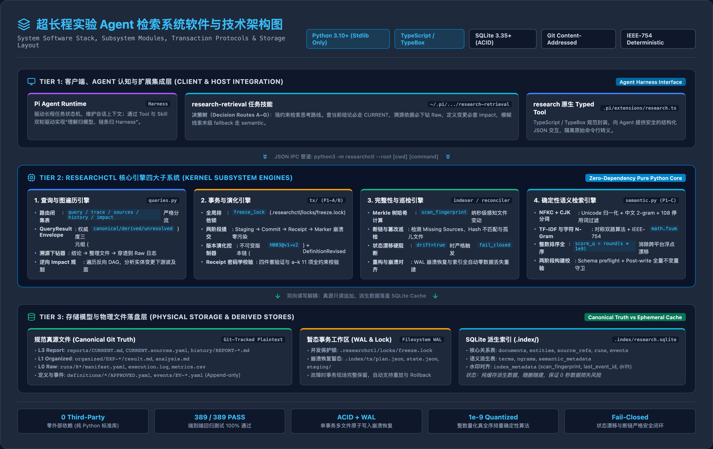

# 超长程实验 Agent 检索系统架构与技术设计汇报

> 本文档用于课题组会（Seminar）技术汇报展示，全面阐述面向现实时间超长程实验（Ultra-Long-Horizon Experiments）的 Text Agent 检索与科研状态系统的核心架构与工程落地。

---

## 1. 架构全景


上图展示了检索系统的三维解耦架构：
- **左侧（Layer A）**：Agent 认知与调用层，通过任务技能决策树注入规则，由原生 Typed Tool 与底层 CLI 交互；
- **中间（Layer B）**：四层科研物理层级（L0–L3）与五层检索分层体系，支持自顶向下的“阅读检索链”与自底向上的“证据溯源链”；
- **右侧（Layer C）**：事务保障与治理门禁，通过原子单事务 Hook、不可变版本演化 Gate 及定期 Reconciler 保证信息链不断。

---

## 2. 软件与子系统技术架构



上图详细剖析了系统在软件实现层面的三层技术栈与四大核心引擎：
1. **Tier 1 交互与扩展集成层**：
   - **Pi Agent Runtime**：宿主 Coding Agent 环境，调度长期科研会话；
   - **`research-retrieval` 任务技能**（`~/.pi/agent/skills/task/research-retrieval/`）：注入 7 条典型检索路径（路线 A–G）决策树；
   - **`research` 原生 Typed Tool**（`.pi/extensions/research.ts`）：基于 TypeScript / TypeBox 规范定义，向 Agent 上下文直接返回结构化 JSON。
2. **Tier 2 `researchctl` 内核四大子系统引擎**（纯 Python 3 标准库，零第三方依赖）：
   - **查询与图遍历引擎**（`queries.py` / `resolver.py`）：维护封闭路由表、规范 QueryResult Envelope 及溯源下钻器与逆向 DAG 影响遍历；
   - **事务与演化引擎**（`tx/`）：基于排他锁 `freeze_lock`、WAL 日志、两阶段提交及 11 项 receipt 验证器维护假说/定义版本不可变链；
   - **完整性检测引擎**（`indexer.py` / `reconciler.py`）：计算类 Merkle 树的 `scan_fingerprint`，检测文件内容篡改与孤儿引用，漂移时严格 `fail_closed`；
   - **确定性语义引擎**（`semantic.py`）：Unicode NFKC 归一化分词、字符 n-gram 模糊召回、IEEE-754 `math.fsum` 浮点双路加权及 `1e-9` 整数量化全序排序。
3. **Tier 3 存储与数据分层**：
   - **规范真源层**（Git-Tracked Plaintext）：纯文本受控文件（Report / Organized / Raw / Events / Definitions）；
   - **暂态工作区**（Filesystem WAL）：并发锁与崩溃恢复暂态目录（`.index/tx/`）；
   - **SQLite 派生层**（`.index/research.sqlite`）：纯派生缓存，随删随建，保证 0 秒数据丢失风险。

---

## 3. 核心问题与设计范式转换

### 3.1 传统 RAG 与 Coding Agent 在超长程科研中的失效

在传统长程任务中，Agent 通常依赖“上下文扩展”或“Embedding 向量切片检索”。但在**现实时间跨越数天、数周、涉及多轮间断会话**的科研实验中，传统方案存在三大根本缺陷：

1. **版本漂移与脑补（Version Drift）**：当实验参数从 `E017@v3` 演化为 `E017@v4` 时，向量相似度无法识别精确版本边界，导致 Agent 检索出混杂的新旧数据并脑补结论；
2. **因果链断裂（Provenance Broken）**：无法回答“为什么这个结论成立？来自哪个整理文件？原始运行日志和测量指标在哪里？”；
3. **第二真源陷阱（Second Source of Truth）**：将向量数据库或缓存作为事实依据，一旦派生数据与底层文件脱节，Agent 便在错误的幻觉中越陷越深。

### 3.2 我们的五大核心设计思想

依据《超长程实验 Agent 检索系统设计方案.md》§25，系统确立了不可动摇的五项原则：

1. **Report 是入口，不是唯一真源**：报告（`CURRENT.md`）是叙述入口，最终可审计底座是 Raw 数据。
2. **Index 是导航，不是证明依据**：`INDEX.md` 仅用于跳查目录，可随删随建，不作为证明事实。
3. **Organized 是主要研究工作层**：实验整理文件承上启下，必须显式声明所消费的原始 Raw 材料。
4. **Raw 是最终可审计底座**：不可变的测量指标与执行日志是唯一事实根源。
5. **历史来源必须锁定具体版本**：历史报告引用的整理文件必须绑定具体 Git Commit 与 SHA-256 哈希，绝不只记易变的物理路径。

---

## 4. 四大科研物理层级（L0 → L3）

系统不强行推翻科研工作流，而是依托物理文件系统规范化四个层级：

```text
L3 Report    (reports/CURRENT.md + history/REPORT-NNN.md + sources.yaml)
    ↓ 依据引用
L2 Index     (index/INDEX.md: 假说 / 时间 / 主题 / 状态导航)
    ↓ 跳查定位
L1 Organized (organized/EXP-017/result.md, analysis.md: 关键实验整理)
    ↓ 消费材料
L0 Raw       (runs/R051/manifest.yaml, execution.log, metrics.csv: 原始执行事实)
```

- **双向链条支持**：
  - **阅读检索链（Downstream）**：`CURRENT → Index → Organized → Raw`，帮助接手任务的新 Agent 快速理解项目现状；
  - **溯源审计链（Upstream）**：`Conclusion → Organized@Commit → Run → Raw`，支持对任意历史结论进行穿透式审计。

---

## 5. 五层检索分层体系与优先级铁律

系统正式划分了五层检索能力，并严格规定**显式结构优先于语义猜测**：

| 层级 | 技术实现 | 核心命令 / 工具 | 定位与适用场景 |
|---|---|---|---|
| **Layer 1：物理路径检索** | 文件系统定位 | `glob`, `find`, `ls` | 物理事实：定位 Experiment/Run 目录（最廉价、最可靠） |
| **Layer 2：词面检索** | 文本精确搜索 | `grep`, `read` | 文本事实：查找精确 ID、报错日志、变量名 |
| **Layer 3：结构化元数据** | SQLite 派生索引 | `researchctl query` | 派生索引：跨实体类型/状态筛选，随删随建 |
| **Layer 4：溯源关系检索** | 引用图谱分析 | `researchctl sources / trace / history / impact` | 因果依据：结论溯源到 Raw、历史报告演化、变更下游波及面 |
| **Layer 5：语义检索兜底** | TF-IDF + N-gram | `researchctl query --semantic` | **末级 Fallback**：仅用于模糊回忆与词面偏差，权威度恒为 `advisory` |

---

## 6. 状态机与不可变事务治理门禁

系统通过三大确定性门禁确保超长程科研的“信息链不断”：

1. **P1-A 报告冻结事务门禁（`freeze-report`）**：
   - 冻结报告时自动校验所有引用的哈希并记录到 `REPORT-NNN.sources.yaml`；
   - 产生 `ReportFrozen` 规范事件与 receipt 四件套；
   - WAL 日志保障崩溃恢复，杜绝半提交状态。
2. **P1-B 定义演化门禁（`revise-definition` & `impact`）**：
   - 假说与定义发生语义变更时，禁止直接覆写，必须推进版本号（`H003@v1 → H003@v2`）；
   - 产生 `DefinitionRevised` 事件，并自动执行逆向依赖 Impact 分析，向下游所有未重新验证的实验与报告级联传播 `stale` 标记。
3. **P0-C 完整性巡检门禁（`reconcile`）**：
   - 定期自动比对物理文件与派生元数据；
   - 检测引用断链、文件内容篡改、孤儿文件；检出漂移时立即触发 `fail_closed` 保护。

---

## 7. Agent 认知与调用层（Pi 集成）

为让 Agent 具备“机械化科研检索素养”，系统构建了完整的交互包装：
- **`research` Typed Tool**：在 Pi 中以原生 TypeScript 扩展暴露统一检索工具（支持 `query`, `trace`, `sources`, `history`, `impact`, `reconcile`, `index`），直接在上下文输出结构化 JSON，免去拼凑命令行。
- **`research-retrieval` Task Skill**：注入 7 条典型检索路径（路线 A 到 G），规定：
  - 查当前结论必须先读 `CURRENT.md`；
  - 查数据根源必须 `trace` 到 Raw，严禁凭空估算；
  - 查历史变更必须比较 `history` 锁定的 Commit；
  - 严禁一开始就直接调用向量语义检索。

---

## 8. 组会演讲要点与答辩 Q&A 预案

### Q1：为什么不用现成的 LangChain / LlamaIndex + 向量数据库（如 Chroma/Pinecone）？
> **回答**：科研实验对**因果性、版本精确性与确定性**要求极高。向量检索本质是统计概率，无法区分 `E017@v3` 与 `E017@v4` 的严格边界，且容易因文档切片丢失上下文逻辑。本方案将语义检索降级为 Layer 5 的兜底建议层，主干完全由 Git Commit、文件哈希和 SQLite 关系图构成的确定性状态机支撑，完全杜绝了幻觉。

### Q2：如何保证 Agent 连续运行数周后，历史数据依然可信？
> **回答**：采用不可变文件 + 事务 Receipt 机制。每次报告冻结或假说修订都会生成不可篡改的事件（Event），并在元数据中持久化 SHA-256 签名。哪怕项目换了 Agent 或发生了上下文压缩，新 Agent 只需运行 `reconcile` 即可在毫秒级内验证整个证据链的真实性。

### Q3：系统的实现代价与外部依赖如何？
> **回答**：全系统遵循极致轻量原则，**零第三方依赖**（纯 Python 标准库），不需要安装庞大的数据库服务或外置 API，具备 100% 离线运行和跨环境可移植性。目前已沉淀 389 项端到端自动化测试，通过率 100%。
